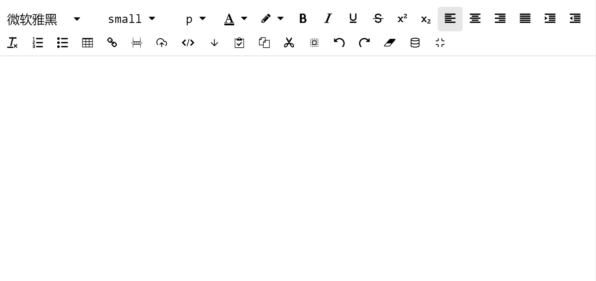
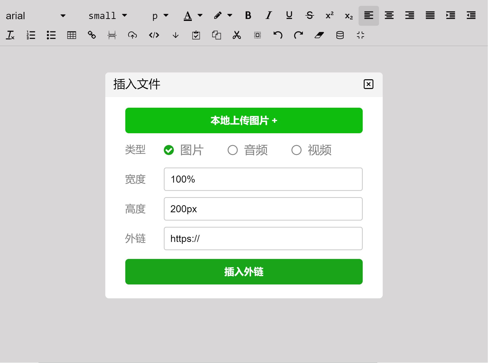

# ng-zeditor（Angular版）

## Description

一款简单、小清新的编辑器  

[在线演示](https://zzp-dog.github.io/ng-zeditor/dist2/test/index.html)  
[github](https://github.com/zzp-dog/ng-zeditor)  

## UI





## Install

```shell
yarn add @bigbigbird/ng-zeditor@latest -S
# or
npm install @bigbigbird/ng-zeditor@latest -S
```

## Quick Start

in app.module.ts

``` typescript
import { BrowserModule } from '@angular/platform-browser';
import { NgModule } from '@angular/core';

import { AppComponent } from './app.component';
import {NgZeditorModule} from '@bigbigbird/ng-zeditor';
@NgModule({
  declarations: [
    AppComponent
  ],
  imports: [
    BrowserModule,
    NgZeditorModule
  ],
  providers: [],
  bootstrap: [AppComponent]
})
export class AppModule { }

```

in app.component.ts

``` typescript
import { Component } from '@angular/core';

@Component({
  selector: 'app-root',
  templateUrl: './app.component.html',
  styleUrls: ['./app.component.scss']
})
export class AppComponent {
  /** 回显 */
  html = '<div>hello world!</div>';
  /** 不要提交按钮 */
  hasBtn = false;
  /** 主题 */
  theme = 'g';
  /** 参数配置，默认为下面这个 */
  options: object = {
    /** 编辑内容的最大字节数 */
    maxsize: 65535,
    image: {
      /** 上传的最大图片或插入图片外链数量 */
      count: 5,
      /** 小于指定字节数会进行base64编码 */
      base64: 60000
    },
    audio: {
      /** 单次上传音频或插入音频外链的最大数量 */
      count: 1,
      /** 小于指定字节数会进行base64编码 */
      base64: 0
    },
    video: {
      /** 单次上传视频或插入视频外链的最大数量 */
      count: 1,
      /** 小于指定字节数会进行base64编码 */
      base64: 0
    }
  };

  /**
   * ngModelChange
   * @param html 输入的html
   */
  change(html: string) {
    console.log('ngModelChange');
    console.log(html);
  }
  /**
   * 前提hasBtn为true
   * 点击提交按钮
   * @param obj 编辑内容详细信息
   */
  recieveContent(obj: {
    innerHTML: string,
    innerText: string,
    media: {
      image: { type: 'url' | 'base64', src: string },
      audio: { type: 'url' | 'base64', src: string },
      video: { type: 'url' | 'base64', src: string },
    }
  }) {
    console.log('recieveContent');
    console.log(obj);
  }
  /**
   * 自定义input事件
   * @param html 输入的html
   */
  onInput(html: string) {
    console.log('onInput');
    console.log(html);
  }
  /**
   * 文件上传
   * @param obj 文件类型，文件，关闭弹窗回调
   */
  uploadFile(obj: {
    type: 'image' | 'audio' | 'video', file: any, callback: (v: string | boolean, t?: number) => void
  }) {
    const callback = obj.callback;
    // 关闭弹窗
    // 上传成功
    const src = 'http://www.example.com';
    callback(src);
    // 上传失败
    // callback(false);
    // 上传超时
    // const t = 3000; // 超时时间（单位ms）
    // callback(false, t);
  }

}
```

in app.component.html

``` html
<app-zeditor [(ngModel)]="html" (ngModelChange)="change($event)" [options]="options" [hasBtn]="false"
    (recieveContent)="recieveContent($event)" [theme]="'g'" (onInput)="onInput($event)"
    (uploadFile)="uploadFile($event)"></app-zeditor>
<textarea [ngStyle]="{
    'min-height': '15rem',
    'width': '100%',
    'outline': 'none',
    'resize': 'none',
    'border': '1PX dashed green'
}" [(ngModel)]="html"></textarea>
```

## Browser Support

PC端标准浏览器和IE9+.

## Security

在前端可以使用xss对html进行无害化处理  
在后端可以使用jsoup对html进行无害化处理

## Concat

QQ交流群：486273737  
Name:  木懵の狗纸  
个人QQ: 1029512956  
Email: 1029512956@qq.com  
